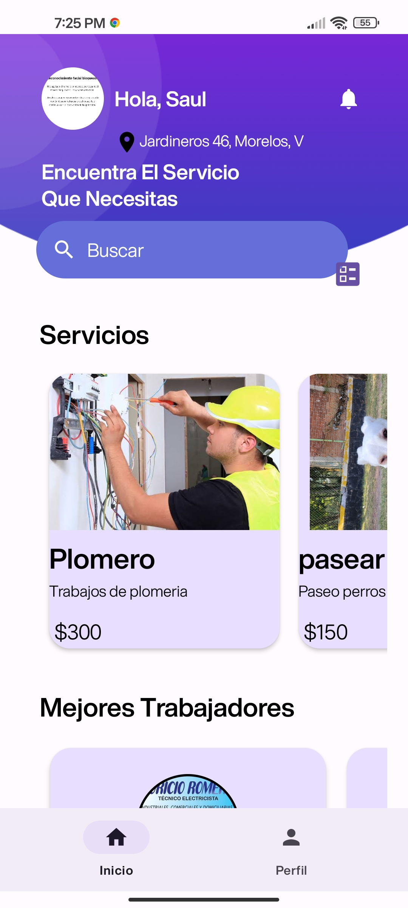

# Workent

Aplicaciòn Movil para conectar a trabajadores informales con clientes en la Ciudad de Mèxico

## Descripción

Esta aplicacion permite que los trabajadores pertenecientes al sector informal, puedan registrarse y publicar sus servicios. Permitiendo que algun cliente que lo requiera pueda contactarse  con el y solicitar sus servicios

## Capturas de Pantalla

## Funcionalidades

- Registro de usuarios
- Publicaciòn de Servicios 
- Chat
- Pago con tarjeta (Modo Prueba)

## Requisitos

Android 7.0 o Posterior
Conexiòn a internet

## Contacto

Si tienes alguna pregunta o sugerencia, no dudes en contactarme en [saulservin7@gmail.com].

